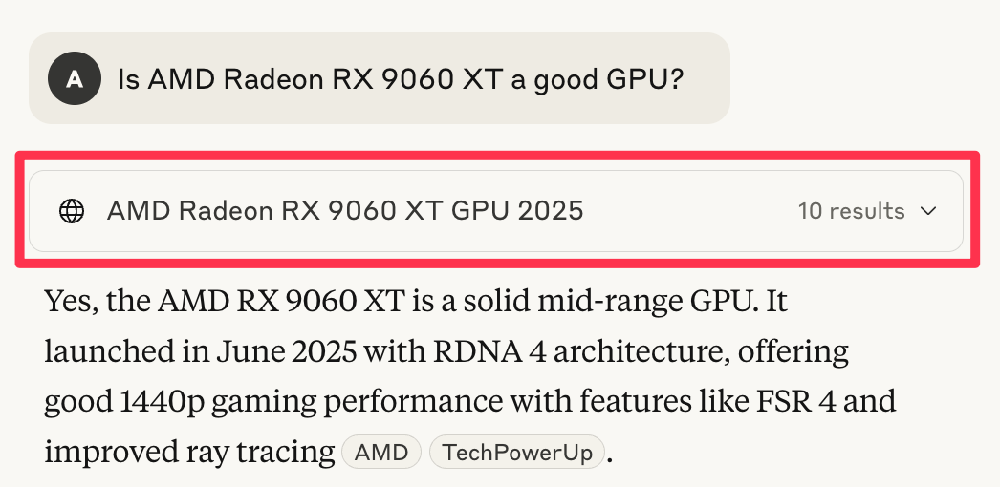
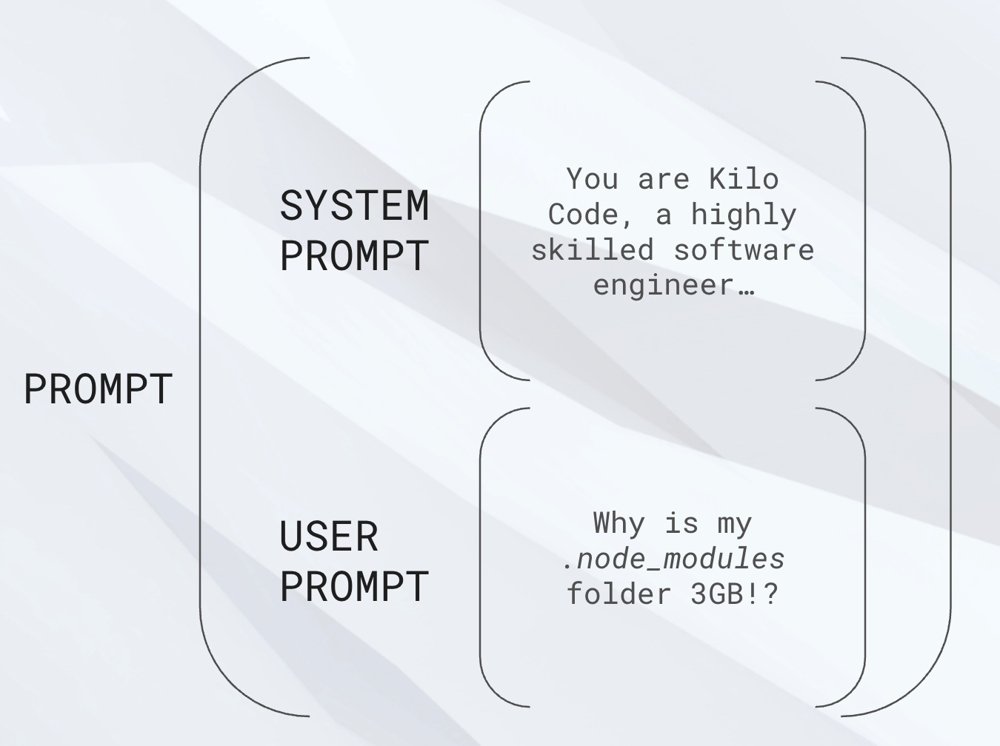
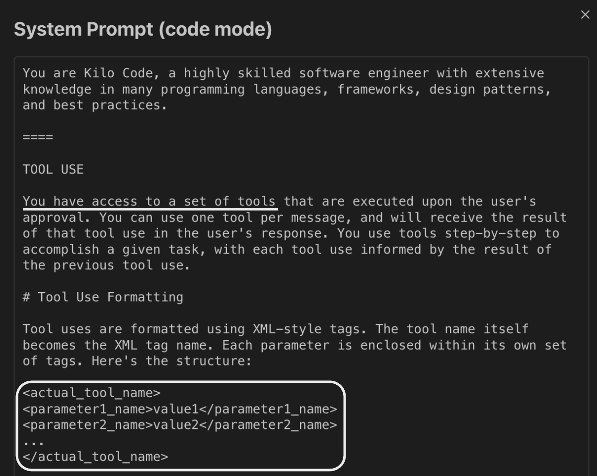
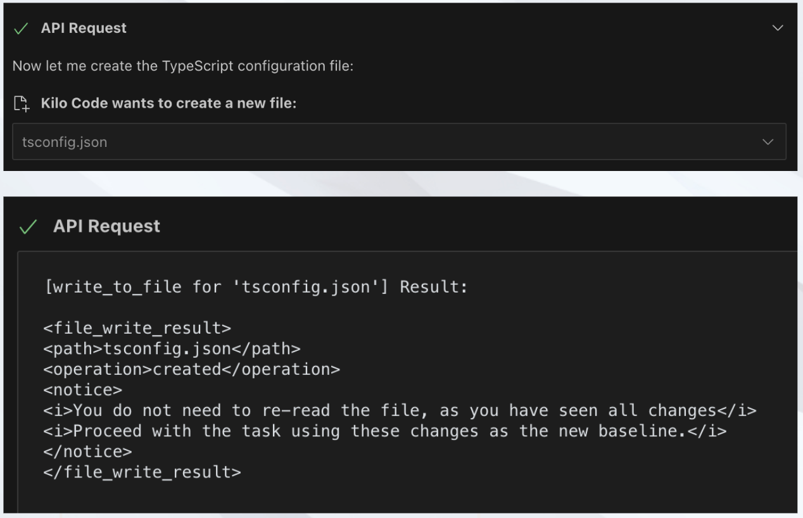
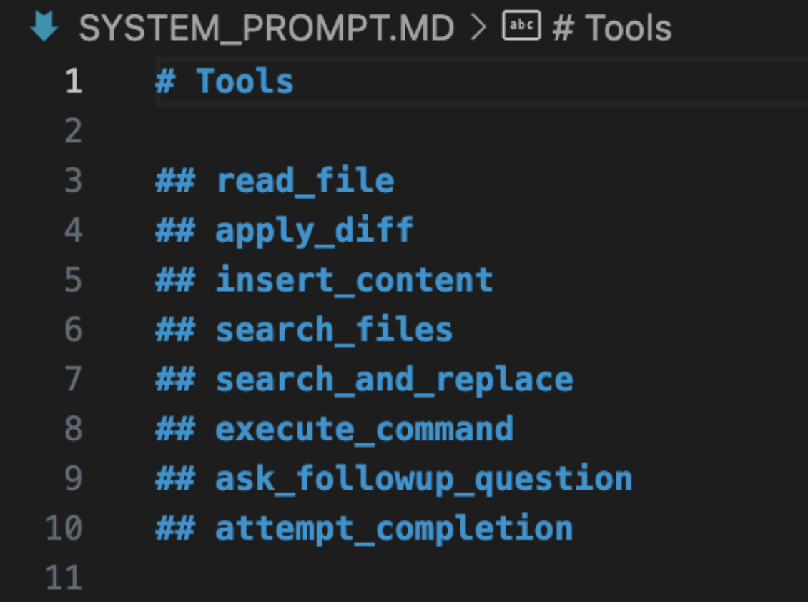
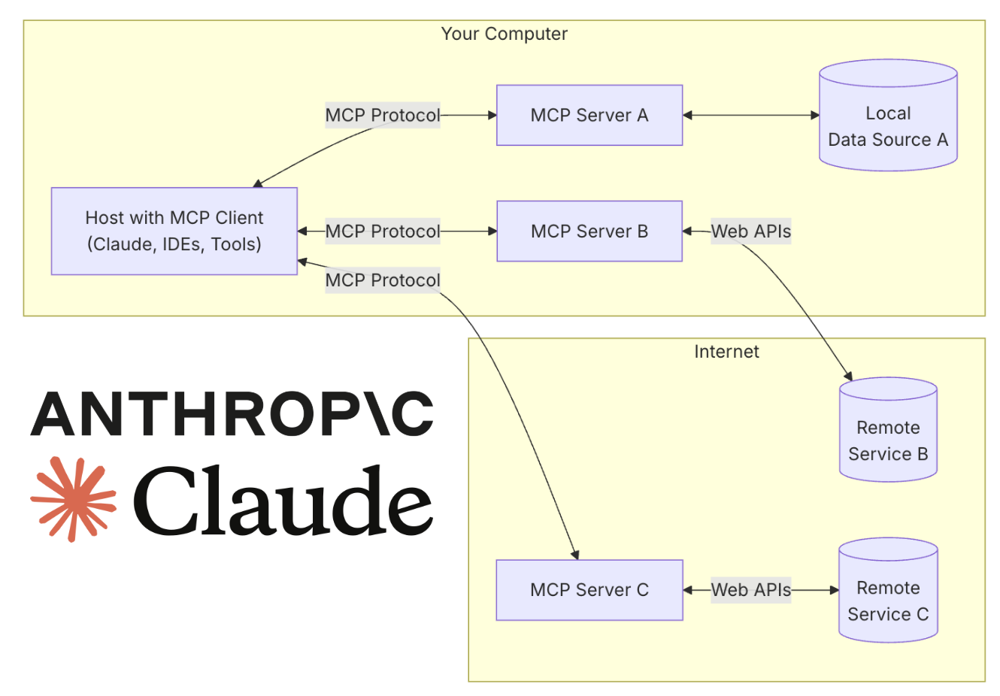
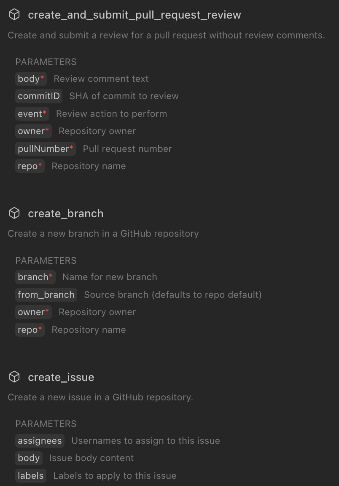
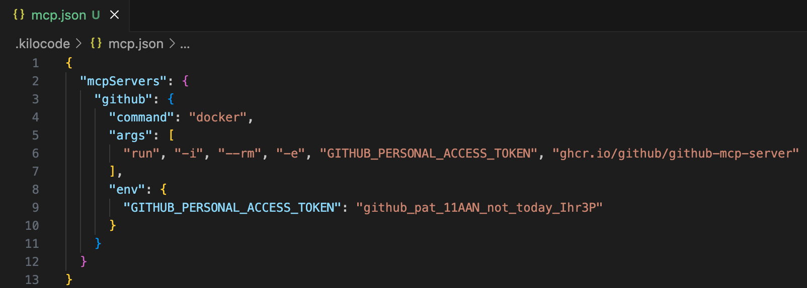
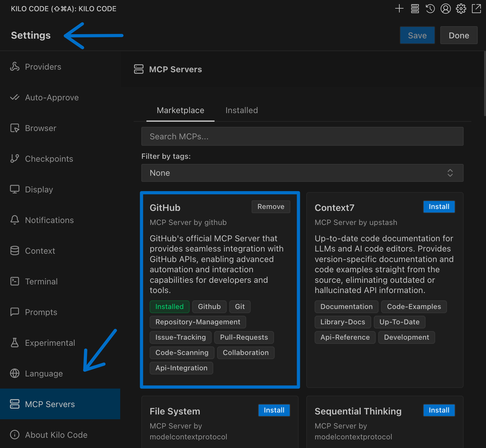
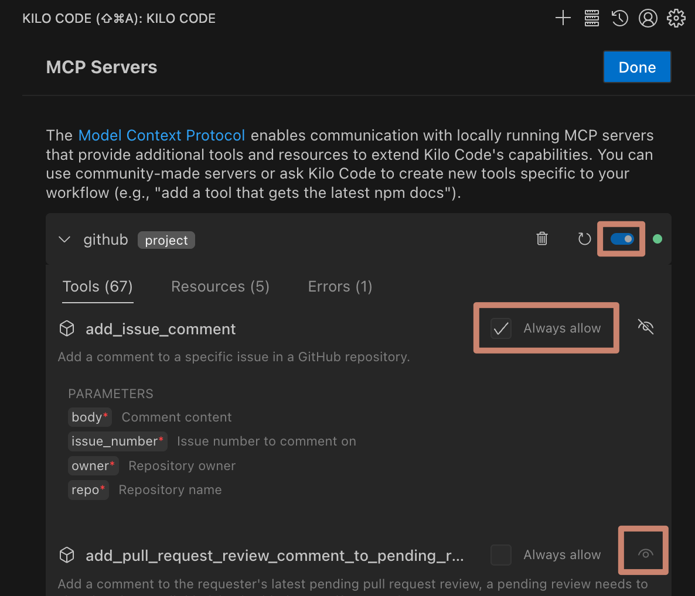

# Why MCPs Are the Missing Piece You Need
### And How They Actually Work (Spoiler: It's Not What You Think)

You know that moment when you ask `Sonnet` to "search for the latest React documentation" and it confidently starts typing out what looks like search results? Here's the thing that'll blow your mind: **It isn't actually searching anything**. Neither is `Gemini Pro` when it "browses the web" or `GPT-4.1` when it "edits your files."

LLMs don't use APIs. They can't. They are literally not capable of it.

## The Great AI Illusion

When you see Kilo Code editing your files, it's not Sonnet directly manipulating your filesystem. When Claude "searches" something, it's not Opus making HTTP requests. The AI models are doing what they do best: **writing _formatted_ text [commands]**. Then the *agent* (Kilo Code, Claude's agent application, etc.) reads those commands and actually executes the tools.

How many requests to and responses from an AI model are happening on this screenshot? It looks like only one, but it's just a deceitful trick - there are two requests and therefore two responses. In first, the model is asked about a new GPU which it doesn't know, so it needs to run a search. Search is done by the Claude application installed on my macbook, and then the search results are sent again to the model - in a second request!

The AI models are like a really smart person who can only, exclusively communicate through written notes, and there is a someone with hands who actually does the work. The AI writes "please create a file called `app.js` with this content," and Kilo Code goes "got it" and creates the file.

## But How Does This Works?

Every time you send a message to an AI model, the request contains two parts:

1. **Your input** - what you actually typed
2. **System prompt** - the behind-the-scenes instructions

Those instructions contain something very important - tool definitions! They tell to the model "hey, if you need to write to a file, format your response like this: `<write_to_file><path>...</path><content>...</content></write_to_file>`" 

After reading those instructions, AI model knows it can search, edit files, execute console commands, etc, etc. If the model decides to use such a tull, it will response with xml-structured answer, agent will parse this answer, do actions accordingly, and return the response so the Model knows how it all went.

Kilo Code ships with about 17 native tools - [`write_to_file()`](https://kilocode.ai/docs/features/tools/write-to-file), [`execute_command()`](https://kilocode.ai/docs/basic-usage/how-tools-work), [`browser_action()`](https://kilocode.ai/docs/features/browser-use), and more. Each one is carefully defined in the system prompt so the AI knows exactly how to "ask" for what it needs.

## Enter MCP: The Universal Tool Protocol

But here's the problem: there are millions of APIs out there. GitHub's API alone has hundreds of endpoints. Slack, Notion, databases, custom internal tools - the list is endless. We can't build native tools for everything - the system prompt will explode!

This is where Model Context Protocol (MCP) comes in. Published by Anthropic in November 2024, MCP is essentially a standardized way to give AI models access to external tools without hardcoding them into every AI assistant.

Think of it like this: instead of Kilo Code needing to know about every possible API, MCP servers act as translators. Each MCP server says "hey, I can handle GitHub operations" or "I've got Slack covered" and provides the tool definitions the AI needs.

An MCP server does two main things:
1. **Tells the AI what tools are available** - "I have tools for creating issues, reading repositories, managing pull requests"
2. **Executes tools when requested** - Actually makes the API calls when the AI asks

Meanwhile, the AI agent (In MCP terminology it's called MCP client) does its part:
1. **Collects available MCP tools** and _adds them to the system prompt_
2. **Routes tool requests** - either uses native tools directly or calls the appropriate MCP server

## Real Examples That Actually Matter

Let's look at some MCP servers that are genuinely useful:

**GitHub MCP Server** provides over 65 different tools. Instead of the AI saying "I can't access your GitHub," it can now create issues, review pull requests, check repository stats, and manage releases. All through standardized tool calls.

**Context7** might only provide two tools, but don't underestimate it. It maintains up-to-date documentation for thousands of software projects. When you're working with a library that just released version 4 but the AI was trained on version 3 docs, Context7 will save you from fighting with a model which is trying to use obsolete approaches and deprecated or even removed method calls.

**Database MCP servers** let you query your production database directly from your AI assistant. "Show me all users who signed up this week" becomes a simple request instead of a manual SQL session!

## Sample Configuration

That's how your `.kilocode/mcp.json` file looks like when you install GitHub MCP locally - I've simplified it a bit but overall idea is here! It explains to Kilo Code on how to call this server and request it tools or use one of it. As you see, GitHub MCP is distributed as a Docker image. Others can be distributed in different form and shape

But no need to create the files - installation is doable via GUI.

## The Reality Check: It's Not All Sunshine

MCPs are powerful, but they come with real costs - well, quite literally:

**Token overhead**: Every MCP tool definition gets added to your prompt. More tools = more tokens = higher costs.

**Latency**: Tool execution adds delays. Network calls to external APIs aren't instant.

**Complexity**: More moving parts mean more potential failure points. MCP servers can crash, APIs can be down, authentication can fail.

**Context window consumption**: Tool responses eat into your available context. A large API response might push important context out of the window.

**Cost multiplication**: You're not just paying for the AI's thinking - you're paying for all those tool definitions in every single request.

This is why you shouldn't just install every MCP server you find. Be strategic:
- Turn off servers you're not actively using
- Disable specific tools within servers that you don't need
- Use project-specific configurations instead of global installs when possible
- Monitor your token usage and costs!

## Getting Started Without the Overwhelm

Ready to try MCP? Here's the practical approach:

1. **Start small** - Pick one specific problem you want to solve (like GitHub integration)
2. **Install locally first** - First install MCP locally instead (per project), not globally. You can move them later!
3. **Test thoroughly** - Make sure the server works reliably before depending on it
4. **Monitor costs** - Keep an eye on how MCP usage affects your API bills

The setup is straightforward in Kilo Code. Head to `MCP Servers → Installed` and you can configure both global and project-specific servers. The interface makes it easy to enable/disable servers and individual tools as needed.

## The Bottom Line

MCP isn't just another integration method - it's a fundamental shift in how AI assistants can interact with the world. Instead of being limited to a fixed set of capabilities, your AI can now adapt to your specific workflow and tools, even proprietary. The protocol is still young (remember, it was only published in November 2024), but the potential is massive. We're moving from "AI assistants that can do some predefined tasks" to "AI assistants that can learn to use any tool you need."

MCPs solve a real problem: the gap between what AI models can theoretically do and what they can actually access. They're not perfect - they add complexity and cost - but they're the missing piece that makes AI assistants genuinely useful for specialized workflows. The era of AI assistants that can only work with built-in tools is ending. MCPs are how we get to AI that works with *your* tools.

---

*Got questions or ideas? Join our [Discord community](https://kilo.love/discord) where developers share their favorite MCP servers and configurations.*